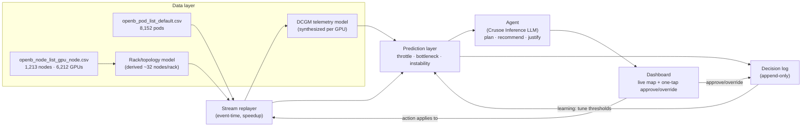
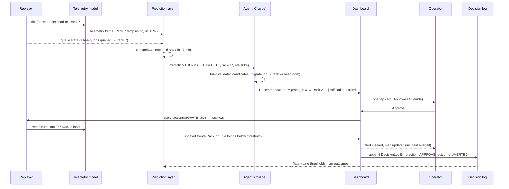

# GPU Cluster Sentinel — Design & Architecture

**Project:** GPU Cluster Sentinel ("Sentinel")
**Related docs:** [PRD.md](./PRD.md) · [TASKS.md](./TASKS.md)

This document describes how Sentinel is built to deliver the [North-Star demo](./PRD.md#5-north-star-demo-flow-the-60-second-flow): *predict → explain → one-tap → avert → log*, driven by the real Alibaba `openb` trace in this repo.

---

## 1. Architecture overview

```
clusterdata → stream replayer → prediction layer → agent (Crusoe Inference) → dashboard + one-tap override → decision log
```




**Design principles**

- **Demo-first:** the P0 path (replayer → thermal+bottleneck prediction → agent card → dashboard → log) is built end-to-end before anything else.
- **Explainable before clever:** thresholds and trend extrapolation first; ML later. Every alert carries the numeric trend that produced it.
- **Swappable seams:** telemetry is generated behind an interface so a real **NVIDIA DCGM** feed can replace the simulator without touching prediction; the agent has a **templated fallback** if the LLM is down.
- **Deterministic:** fixed seeds + event-time replay ⇒ reproducible demo.


## 2. Component design


### 2.1 Data layer — CSVs → live stream

**Node inventory (**`openb_node_list_gpu_node.csv`**)** is loaded once as the static cluster topology: 1,213 nodes, 6,212 GPUs, models `{G2, T4, P100, G3, V100M32, V100M16, A10}` (see [PRD §2.1](./PRD.md#21-cluster-inventory--openb_node_list_gpu_nodecsv)). Each node expands into `gpu` GPU objects.

**Pod stream (**`openb_pod_list_default.csv`**)** is the replayable event source: each pod contributes up to three timestamped events derived from `creation_time`, `scheduled_time`, `deletion_time`.


#### Derived rack / topology model

The trace has **no rack column**, so Sentinel derives it. Default rule: **sort nodes by** `sn` **and bucket into racks of** `RACK_SIZE` **(default 32) ⇒ ~38 racks** for 1,213 nodes. Alternative (recommended, cleaner thermals): **group within GPU model** so each rack is homogeneous (e.g., all-G2 racks of 8-GPU nodes). Rack topology gives us: rack membership per node, rack-level aggregate utilization/temperature, and neighbor relationships for thermal coupling and migration targets. Racks are stable across a run (deterministic). 

```
Rack = { rack_id, node_ids[], gpu_model?, capacity_gpus, neighbors[] }
```


#### Telemetry: real vs. synthesized


| Signal                                                                | Source in v1                                | Notes                                        |
| --------------------------------------------------------------------- | ------------------------------------------- | -------------------------------------------- |
| Node inventory, GPU model/count, CPU/mem                              | **Real** (node CSV)                         | Static topology                              |
| Pod arrival/schedule/free, `num_gpu`, `gpu_milli`, `qos`, `pod_phase` | **Real** (pod CSV)                          | The replay stream                            |
| GPU utilization                                                       | **Derived** from scheduled `gpu_milli` load | Real load → modeled util                     |
| Temperature, power, SM/mem clocks                                     | **Synthesized** (DCGM model)                | Function of load; no trace data              |
| Throttle reasons                                                      | **Synthesized**                             | Emitted when modeled temp/power crosses caps |
| XID errors, ECC errors                                                | **Synthesized** (rare, load/age-weighted)   | Node-instability signal                      |
| Rack topology                                                         | **Derived**                                 | Trace has no rack field                      |


### 2.2 Stream replayer

**Event-time replay.** Build a merged, time-sorted event queue from the pod CSV:

- `POD_CREATED` at `creation_time` (enters queue)
- `POD_SCHEDULED` at `scheduled_time` (placed on a node/GPU; consumes `gpu_milli`)
- `POD_DELETED` at `deletion_time` (frees resources)

Pending pods (897 with empty `scheduled_time`) generate a `POD_CREATED` but never schedule → real queue pressure. 34 pods with `deletion_time == 12,902,960` are treated as **censored** (still running at trace end).

**Speedup & tick model.** A configurable `SPEEDUP` maps trace-seconds → wall-clock (`wall = (event_time − t0) / SPEEDUP`). A fixed **tick** (e.g., 1 simulated tick = N trace-seconds) advances a virtual clock; on each tick the replayer applies all events up to `now`, recomputes placement/queue state, and asks the telemetry model to emit a fresh telemetry frame. This keeps prediction sampling uniform.

**Window selection.** The full trace is **149.3 days** with bursty, back-loaded arrivals (peak **56 concurrent** pods near day 137; busiest day = 678 arrivals). For the demo, select a **dense window** (e.g., a slice around the concurrency peak) and replay at a large `SPEEDUP` so a believable "3 heavy jobs queued on a rack" materializes within the 60-second flow. Play/pause/seek are exposed via [FR-10](./PRD.md#6-functional-requirements).

**Placement model.** The trace already contains scheduling outcomes; v1 replays them faithfully. For migration actions, the replayer supports **overriding placement** of a specific pod to a target rack/node (the operator's approved action), which recomputes that rack's load and telemetry.


### 2.3 DCGM telemetry model (synthesized)

For each GPU, per tick, produce a `GpuTelemetrySample`. The model is a simple, explainable function of **load** (sum of `gpu_milli` of pods on that GPU / 1000), **rack neighbors** (thermal coupling), and the GPU **model's** thermal profile.

- **Utilization** `util = clamp(load + noise, 0, 1)` (real `gpu_milli` drives this).
- **Temperature** relaxes toward a load-driven target with thermal inertia:
`temp_target = idle_temp + (max_temp − idle_temp) * util + rack_coupling` ; `temp += (temp_target − temp) * α` per tick. Per-model `idle/max` (e.g., data-center parts like V100/T4 idle ~30–35 °C, throttle ~83–87 °C).
- **Power** `power ≈ idle_w + (tdp − idle_w) * util` with per-model TDP (P100 250 W, V100 300 W, T4 70 W, A10 150 W; G2/G3 are Alibaba-anonymized models → assigned representative profiles).
- **Clocks** `sm_clock = base_clock` until `temp > throttle_temp` or `power > power_cap`, then reduced proportionally → this *is* the throttle signal.
- **Throttle reasons** set when clocks are capped (`SW_THERMAL`, `HW_THERMAL`, `SW_POWER_CAP`).
- **XID / ECC errors** emitted as rare Poisson events with rate rising in a node's `instability_score` (age/thermal/power stress) — the node-instability signal.

> **Real DCGM later:** the simulator implements a `TelemetrySource` interface (`sample(gpu_id, t) → GpuTelemetrySample`). A `DcgmTelemetrySource` reading `dcgmi`/DCGM-exporter fields (`GPU_TEMP`, `POWER_USAGE`, `SM_CLOCK`, `XID_ERRORS`, `ECC_`*, `CLOCK_THROTTLE_REASONS`) drops in with no change to the prediction layer.


### 2.4 Prediction layer

Consumes telemetry frames + queue/placement state; emits `Prediction` objects. **Explainable models first.**

**Features (rolling windows per GPU/node/rack):**

- Telemetry trends: temperature slope (°C/min), power slope, util EWMA, clock trend.
- Thermal headroom: `throttle_temp − current_temp`.
- Queue depth per rack (pending pods that would target that rack), count of "heavy" jobs queued (`num_gpu ≥ 2` or `gpu_milli` large).
- Rack utilization: fraction of rack GPU capacity consumed.

**Predictors:**

1. **Thermal throttle (P0):** linear/robust extrapolation of the temperature trend to the throttle threshold ⇒ **time-to-throttle** `Δt = headroom / max(slope, ε)`. Fire an alert when `Δt < LEAD_TIME` (e.g., < 8 min) with confidence from fit quality. **Evidence** = the temp trend + threshold line.
2. **Scheduling bottleneck (P0):** detect rising queue depth + heavy jobs converging on a hot/full rack (`rack_util > u`* AND `queued_heavy ≥ k`). **Evidence** = queue depth trend + rack utilization.
3. **Node instability (P1):** score from XID/ECC event rate, clock instability, power excursions; alert when score crosses a threshold or trends up sharply. **Evidence** = error-rate trend.

Each `Prediction` carries `type, target (gpu/node/rack), severity, eta_seconds, confidence, evidence[]`. A lightweight ML upgrade (e.g., gradient-boosted time-to-event) can replace the extrapolation later without changing the interface.

### 2.5 Agent layer — Crusoe Inference

The agent turns a `Prediction` into a **human-readable recommendation** for a non-technical operator, plus a concrete action.

**Role of the LLM (Crusoe Inference):**

- **Plan/decide:** given the prediction + candidate mitigations from the recommender, choose the best action and phrase *why* in plain language a non-technical operator understands.
- **Justify:** produce a one/two-sentence rationale referencing the trend ("Rack 7 is heating ~2 °C/min with 3 heavy jobs queued; it will throttle in ~8 min").

**Migration recommendation logic (deterministic, LLM narrates it):**

1. Identify the offending target (hot/queued rack).
2. Pick a **migration candidate job** (a queued/movable heavy job on that rack).
3. Score alternative racks by **headroom** = free GPU capacity × thermal headroom × model compatibility; pick the best (e.g., "Rack 2: cooler, has capacity").
4. Emit `Recommendation { action: MIGRATE_JOB, job_id, from_rack, to_rack, expected_effect }`.

**Loop:** `predict → build candidate actions (recommender) → LLM selects + justifies → surface card → await operator → apply/log`. 

**Guardrails:**

- LLM only **chooses among validated candidate actions**; it cannot invent unsafe placements (target must actually have capacity/headroom).
- Structured output (JSON action + text justification); validated before display.
- **Fallback:** if Crusoe Inference is unavailable/slow (> timeout), surface a **templated** recommendation from the recommender directly ([NFR-5](./PRD.md#7-non-functional-requirements)).

**Crusoe Inference interface (sketch):**

```python
class Agent:
    def recommend(self, prediction: Prediction, cluster_state: State) -> Recommendation:
        candidates = self.recommender.candidates(prediction, cluster_state)  # deterministic, validated
        resp = crusoe.chat(model=CRUSOE_MODEL, messages=build_prompt(prediction, candidates),
                           response_format="json")   # returns chosen action + justification
        return validate(resp, candidates) or template_fallback(prediction, candidates)
```


### 2.6 Dashboard + one-tap override

**What the operator sees:**

- **Live cluster map:** racks → nodes → GPUs, colored by utilization/temperature; pods flowing in/out as the stream replays.
- **Alert cards:** each surfaced prediction as a plain-language card with the **justifying trend chart** (Rack 7 temp climbing toward the throttle line; Rack 2 flat with headroom) and one **Approve** button + an **Override** control (choose a different target rack / dismiss).
- **KPIs strip:** lead time, incidents averted, approval rate (from the decision log).

**Interaction:** Approve → action sent to backend → replayer applies migration → telemetry/trend recompute → alert clears and the map updates **live** (via websocket). Override → operator's alternative applied and captured as a different action.

**Tech:** FastAPI + WebSocket backend streaming telemetry/prediction frames; React (or a lightweight HTML/JS) frontend with a simple charting lib. One-tap, no CLI, no raw counters ([FR-5/6/7](./PRD.md#6-functional-requirements)).

### 2.7 Decision log & learning

**Every surfaced prediction and its resolution is appended** to an append-only log (JSONL / SQLite). Schema in [§3.6](#36-decision-log-entry).

**Learning from overrides (P1):** aggregate outcomes to tune the prediction layer:

- If operators repeatedly **override/dismiss** a class of alert (e.g., time-to-throttle fires too early) → **raise the threshold / shorten** `LEAD_TIME` for that class (reduce false positives).
- If incidents happen **without** an alert (missed) → **lower the threshold**.
- Approved actions that **averted** incidents reinforce current settings.
- Later: use logged {features → operator decision → outcome} as labeled data to train the ML predictor.


## 3. Data models / schemas


### 3.1 Node


| Field        | Type     | Source  | Example           |
| ------------ | -------- | ------- | ----------------- |
| `sn`         | str (PK) | CSV     | `openb-node-0000` |
| `cpu_milli`  | int      | CSV     | `96000`           |
| `memory_mib` | int      | CSV     | `393216`          |
| `gpu`        | int      | CSV     | `8`               |
| `model`      | str      | CSV     | `G2`              |
| `rack_id`    | str      | derived | `rack-07`         |


### 3.2 Pod / Job


| Field            | Type                                   | Source               | Example                |
| ---------------- | -------------------------------------- | -------------------- | ---------------------- |
| `name`           | str (PK)                               | CSV                  | `openb-pod-0001`       |
| `cpu_milli`      | int                                    | CSV                  | `6000`                 |
| `memory_mib`     | int                                    | CSV                  | `12288`                |
| `num_gpu`        | int                                    | CSV                  | `1`                    |
| `gpu_milli`      | int                                    | CSV                  | `460` (fractional GPU) |
| `gpu_spec`       | str                                    | CSV (empty in trace) | ``                     |
| `qos`            | enum{LS,BE,Burstable,Guaranteed}       | CSV                  | `LS`                   |
| `pod_phase`      | enum{Running,Failed,Pending,Succeeded} | CSV                  | `Running`              |
| `creation_time`  | int (s)                                | CSV                  | `427061`               |
| `scheduled_time` | int (s) / null                         | CSV                  | `427061`               |
| `deletion_time`  | int (s)                                | CSV                  | `12902960`             |


### 3.3 GPU telemetry sample (DCGM-style)

```json
{
  "gpu_id": "openb-node-0123/gpu-3",
  "node_sn": "openb-node-0123",
  "rack_id": "rack-07",
  "model": "V100M32",
  "t": 11821651,
  "util": 0.94,
  "temp_c": 81.5,
  "power_w": 292.0,
  "sm_clock_mhz": 1230,
  "mem_clock_mhz": 877,
  "mem_used_mib": 30000,
  "throttle_reasons": ["SW_THERMAL"],
  "xid_errors": 0,
  "ecc_errors": {"volatile": 0, "aggregate": 3}
}
```


### 3.4 Prediction

```json
{
  "prediction_id": "pred-0001",
  "type": "THERMAL_THROTTLE",          // | SCHEDULING_BOTTLENECK | NODE_INSTABILITY
  "target": {"kind": "rack", "id": "rack-07"},
  "eta_seconds": 480,                   // time-to-event (~8 min)
  "severity": "high",
  "confidence": 0.82,
  "evidence": [
    {"metric": "rack_temp_c", "slope_per_min": 2.1, "threshold": 85, "current": 81.5},
    {"metric": "queued_heavy_jobs", "value": 3},
    {"metric": "rack_util", "value": 0.97}
  ],
  "t": 11821651
}
```


### 3.5 Recommendation

```json
{
  "recommendation_id": "rec-0001",
  "prediction_id": "pred-0001",
  "action": "MIGRATE_JOB",
  "job_id": "openb-pod-4711",
  "from_rack": "rack-07",
  "to_rack": "rack-02",
  "expected_effect": "Rack 7 projected temp drops below 85°C; throttle averted",
  "justification": "Rack 7 is heating ~2°C/min with 3 heavy jobs queued and will throttle in ~8 min. Rack 2 is cooler with free capacity.",
  "source": "crusoe"                    // | "template_fallback"
}
```


### 3.6 Decision-log entry

```json
{
  "decision_id": "dec-0001",
  "t": 11821651,
  "prediction": { "...": "Prediction" },
  "recommendation": { "...": "Recommendation" },
  "operator_action": "APPROVE",         // | OVERRIDE | DISMISS
  "operator_alternative": null,          // e.g., {"to_rack": "rack-05"} on override
  "outcome": "AVERTED",                  // | INCIDENT | UNKNOWN
  "lead_time_seconds": 480,
  "latency_ms": 1350
}
```


## 4. API / interface sketch (between components)


| From → To             | Interface                                                  | Payload                                      |
| --------------------- | ---------------------------------------------------------- | -------------------------------------------- |
| Replayer → Prediction | `on_tick(t, cluster_state, telemetry_frame)`               | current placements, queue, telemetry samples |
| Telemetry model       | `TelemetrySource.sample(gpu_id, t) → GpuTelemetrySample`   | swappable (sim ↔ real DCGM)                  |
| Prediction → Agent    | `Prediction` objects (§3.4)                                | typed predictions w/ evidence                |
| Agent → Dashboard     | `Recommendation` (§3.5) via WS                             | card content + justification                 |
| Dashboard → Backend   | `POST /decision {recommendation_id, action, alternative?}` | operator tap                                 |
| Backend → Replayer    | `apply_action(action)`                                     | migrate/override placement                   |
| Backend → Log         | `append(DecisionLogEntry)`                                 | §3.6                                         |
| Log → Prediction      | `tune(feedback)`                                           | threshold/model updates (P1)                 |
| Backend → Frontend    | `WS /stream`                                               | telemetry + prediction + KPI frames          |


## 5. Sequence diagram — the demo flow




## 6. Tech stack proposal


| Layer                 | Choice                                              | Why                                                                   |
| --------------------- | --------------------------------------------------- | --------------------------------------------------------------------- |
| Data loading / models | **Python** (stdlib `csv`; optional pandas)          | CSVs are small; zero-dependency path works (pandas not required)      |
| Replayer & prediction | **Python** (numpy optional for trends)              | Simple, explainable, deterministic                                    |
| Agent LLM             | **Crusoe Inference** (chat/completions)             | Plan + plain-language justification                                   |
| Backend               | **FastAPI + WebSocket**                             | Async streaming of telemetry/predictions; simple `/decision` endpoint |
| Frontend              | **React** (or lightweight HTML/JS + a charting lib) | Live cluster map, trend charts, one-tap cards                         |
| Storage               | **JSONL / SQLite**                                  | Append-only decision log; easy to query for KPIs                      |
| Config/seed           | env + fixed RNG seed                                | Reproducible demo                                                     |


## 7. Topology & telemetry grounding (real GPU models)

Thermal/power modeling is keyed to the **actual models in the node CSV**:


| Model   | Nodes | GPUs  | Assumed TDP | Notes                                                           |
| ------- | ----- | ----- | ----------- | --------------------------------------------------------------- |
| G2      | 549   | 4,392 | ~300 W      | Alibaba-anonymized; dominant fleet, 8-GPU nodes → hottest racks |
| T4      | 404   | 842   | 70 W        | Low-power inference GPU; high headroom                          |
| P100    | 134   | 265   | 250 W       | Older; runs warmer per watt                                     |
| G3      | 39    | 312   | ~350 W      | Anonymized; 8-GPU dense nodes                                   |
| V100M32 | 30    | 204   | 300 W       | 32 GB HBM                                                       |
| V100M16 | 55    | 195   | 300 W       | 16 GB HBM                                                       |
| A10     | 2     | 2     | 150 W       | Rare                                                            |


Because **G2 + G3 dominate** (4,704 GPUs on 8-GPU dense nodes), racks built from these are the natural hotspots — a realistic place for the demo's "Rack 7 will throttle" scenario. T4 racks (70 W) are natural **migration targets** with high thermal headroom (the demo's "Rack 2").

## 8. Risks & mitigations


| Risk                                      | Impact                | Mitigation                                                                         |
| ----------------------------------------- | --------------------- | ---------------------------------------------------------------------------------- |
| Synthesized telemetry looks unrealistic   | Demo not believable   | Tune per-model thermal curves against public specs; keep trends smooth; fixed seed |
| Trace arrivals too sparse for a 60-s demo | No visible pressure   | Pre-select a **dense window** (near day-137 peak) + high `SPEEDUP`                 |
| Full 149-day trace too long               | Slow demo             | Windowed replay + configurable speedup                                             |
| Crusoe Inference latency/outage           | Card doesn't appear   | Timeout + **templated fallback**; cache last recommendation                        |
| LLM proposes unsafe action                | Bad recommendation    | LLM chooses only among **validated** candidate actions                             |
| No rack ground truth                      | Topology arbitrary    | Deterministic derived racks; document the rule; make `RACK_SIZE` configurable      |
| Over-alerting                             | Operator fatigue      | Thresholds + `LEAD_TIME`; learning-from-overrides raises thresholds                |
| Determinism drift                         | Non-reproducible demo | Event-time replay + seeded RNG + fixed window                                      |


---

See [TASKS.md](./TASKS.md) for the milestone-by-milestone execution plan that builds this design demo-first.