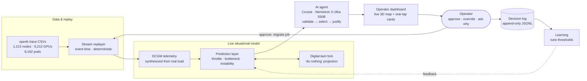

# Mythos 6 — GPU Cluster Ops Agent

> An AI operations agent that watches a live GPU cluster, predicts thermal throttling, scheduling bottlenecks, and node instability **before** they hit workloads, and gives a non-technical operator one-tap recommendations they can approve, override, or question.

**Built for the RAISE AI Hackathon (Paris) — Crusoe track (Statement Three).**
Backend codename: **Sentinel**.

---

## Problem

Modern GPU clusters are expensive, dense, and thermally constrained, and their failure modes stay quiet until they are catastrophic:

- **Thermal throttling** silently caps clocks when a rack runs too hot — jobs slow 15–40% while still reporting "healthy".
- **Node instability** (XID / ECC storms, power excursions, falling clocks) precedes hard failures that kill long-running distributed jobs.
- **Scheduling bottlenecks** build up as heavy jobs converge on a hot rack while headroom sits idle elsewhere.

Today this is handled **reactively** by scarce SREs reading dashboards full of raw DCGM counters. The shift operators who actually run the floor can't act on `XID 79` or `SM_CLOCK 1230 MHz` without escalating — and by the time an expert is paged, the incident has already cost GPU-hours.

## Solution

Mythos 6 turns raw cluster telemetry into a live situational model and drives a tight operational loop:

```txt
live cluster state → predicted risk → agent recommendation → operator action → updated dashboard → decision log
```

Instead of counters, the operator sees a plain-language card:

> **Rack-00 is projected to keep throttling — 8 heavy jobs are queued. Recommended action: migrate `openb-pod-7671` to a cooler rack with headroom. Approve?**

They can **Approve** (the job migrates and the rack cools), **Override** (with a reason — which tunes future alerts), or **Ask Why** (see the exact telemetry trend behind the alert). Every decision is logged, so a human always stays in control.

## Features

- **Live 3D cluster map** — racks/nodes/GPUs colored by utilization and temperature, streaming in real time.
- **Three predictors** — thermal throttle (with time-to-throttle ETA), scheduling bottleneck, and node instability, each with the numeric evidence that triggered it.
- **One-tap agent recommendations** — plain-language migrate-job cards with Approve / Override / Ask Why.
- **Explainability drawer** — every alert links back to the trend + threshold that produced it (no black boxes).
- **Voice alerts** — spoken operator briefings and action confirmations via Gradium TTS.
- **Append-only decision log** — prediction, recommendation, action, outcome, lead time, latency.
- **Learning from overrides** — repeated overrides tighten a class of alert's thresholds automatically.
- **Stress trigger + replay controls** — start/pause/resume and a one-click stress scenario for the demo.
- **Mock mode** — the frontend runs a full demo with no backend attached.

## Approach — the backend pipeline

The Python backend (`sentinel/`) is the heart of the project. It is grounded in the **real Alibaba `openb` GPU-sharing trace** (1,213 nodes · 6,212 GPUs · 8,152 pods · ~149 days), not a scripted mock — every signal traces back to real workload, and throttling *emerges* when real heavy jobs pile onto a dense rack.



Everything below is served to the dashboard over a **FastAPI + WebSocket** layer. Six deterministic stages make up the pipeline:

1. **Data layer (`data/`)** — loads both CSVs into `Node`/`Pod` models and derives **42 model-homogeneous racks** of 32 nodes (the trace has no rack column). A `stats` gate re-asserts the real trace numbers on every run.
2. **Stream replayer (`replay/`)** — merges pod create/schedule/delete into a time-sorted event queue and replays it in event-time at a configurable speedup. Fully deterministic (seed `42`); exposes `apply_action("MIGRATE_JOB", job_id, to_rack)` as the operator-action seam, recomputing rack load on the spot.
3. **DCGM telemetry model (`telemetry/`)** — synthesizes per-GPU temperature, power, SM/mem clocks, throttle reasons, and rare XID/ECC events from the *real* `gpu_milli` load, using per-model thermal profiles (idle/throttle temps, TDP, base clocks) with thermal inertia and rack coupling. It lives behind a swappable `TelemetrySource` interface, so a real NVIDIA DCGM feed drops in with **zero** prediction changes.
4. **Prediction layer (`predict/`)** — rolls EWMA trends over telemetry + queue state and runs three explainable predictors: **thermal throttle** (inverts an RC thermal ODE for a time-to-throttle ETA), **scheduling bottleneck** (queue pressure weighted by GPU-minutes, with a hysteresis latch to stop alert flicker), and **node instability** (XID/ECC + sustained hardware-thermal stress). A **digital-twin fork** of the engine projects the "do nothing" trajectory to quantify how much throttling a proposed action would avert.
5. **AI agent (`agent/`)** — turns a prediction into a one-tap recommendation (detailed below).
6. **Decision log & learning (`decision_log.py`, `learning.py`)** — every surfaced prediction, recommendation, and operator action is appended to a JSONL log with lead time, latency, and outcome. The `OverrideLearner` aggregates outcomes per alert type and tightens or relaxes thresholds, so repeated overrides make an alert class fire less eagerly.

A thread-safe runtime (`server/runtime.py`) drives the replay loop, streams telemetry + events over `WS /stream`, and exposes the REST routes the dashboard consumes.

## AI Agent — Crusoe · Nemotron 3 Ultra 550B

The agent is the decision-making brain that converts a raw prediction into an action a non-technical operator can trust. It runs a **plan → recommend → justify** loop with a hard safety boundary so the LLM can never take an unsafe action:

1. **Deterministic recommender (`recommender.py`)** — for the at-risk rack it selects a movable heavy job, then scores every alternative rack by `free_capacity_fraction × thermal_headroom_fraction`, keeping only racks that can actually fit the job. The output is a short list of **pre-validated, safe** migration candidates.
2. **LLM selection + justification** — the candidates and the prediction's numeric evidence are sent as a structured JSON prompt to **NVIDIA Nemotron 3 Ultra 550B, served through Crusoe Managed Inference** (via an OpenAI-compatible client). The model must return strict JSON that picks exactly one candidate by index and writes a 1–2 sentence, plain-language justification citing the actual trend numbers.
3. **Guardrails** — the LLM may only *choose among validated candidates* — it can never invent a job, a rack, or an unsafe placement. Any malformed or out-of-range response is rejected.
4. **Templated fallback** — if Crusoe is slow, unreachable, or unconfigured (default ~5 s timeout), a deterministic template composes the same card straight from the prediction evidence, so the operator always gets an actionable recommendation. Every recommendation is tagged `source: "crusoe" | "template_fallback"`.
5. **Voice narration** — the chosen recommendation is spoken aloud to the operator via Gradium TTS, with a separate spoken confirmation on approve/override.

Model, endpoint, and timeout are configurable in `sentinel/config.py` / `.env` (`CRUSOE_MODEL`, `CRUSOE_BASE_URL`, `CRUSOE_TIMEOUT_SECONDS`).

## Highlights

- **Safe LLM agency** — Nemotron 3 Ultra 550B (via Crusoe) only *selects and narrates* pre-validated migrations; it can never fabricate an unsafe action.
- **Real data, not a mock** — throttling is an emergent crowding effect of real workload, so the demo is believable.
- **Deterministic & reproducible** — same seed + window ⇒ bit-identical frame sequence. Rehearse once, it replays forever.
- **Explainable-first** — thresholds + trend extrapolation with visible evidence, not opaque ML.
- **Graceful degradation** — LLM guardrails + templated fallback + offline-safe voice alerts keep the loop working even with no API key.
- **Human-in-the-loop by design** — the agent recommends; the operator decides; the system learns from overrides.

## Tech Stack

**Backend (Python, `sentinel/`):** FastAPI + WebSocket, **Crusoe Managed Inference running NVIDIA Nemotron 3 Ultra 550B** (via an OpenAI-compatible client) for the agent, Gradium TTS for voice alerts, and an append-only JSONL decision log. The replay / telemetry / prediction core is stdlib-only and deterministic.

**Frontend (`frontend/`):** Vite + React 19, TanStack Router / Start / Query, Tailwind CSS v4, shadcn/ui, React Three Fiber / Three.js (3D map), Recharts, lucide-react.

## Getting Started

### 1. Backend (API on `http://localhost:8000`)

```bash
pip install -r requirements.txt
cp .env.example .env          # add CRUSOE_API_KEY (and GRADIUM_API_KEY for voice) — both optional
python -m sentinel.server
```

Without an API key the agent uses its templated fallback and voice alerts are skipped, so the demo still runs end-to-end offline.

Optional — run the full loop in the terminal, or the verification gates:

```bash
python -m sentinel.demo          # end-to-end predict → recommend → decide → log demo
python -m sentinel.data.stats    # assert the real trace numbers
python -m sentinel.engine        # heat emerges + migration counterfactual
pytest                           # test suite
```

### 2. Frontend (dashboard on `http://localhost:5173`)

```bash
cd frontend
npm install
cp .env.example .env          # VITE_USE_MOCKS=false to use the live backend
npm run dev
```

To run the dashboard standalone (no backend), set `VITE_USE_MOCKS=true`.

See [integrate.md](./integrate.md) for the frontend/backend contract and [CONTRACTS.md](./CONTRACTS.md) for the frozen telemetry-frame schema.

## Team

- **Omama** — Frontend UX/UI, operator dashboard, integration documentation
- **Lazizbek** — Frontend UX/UI, operator dashboard
- **Omar** — Data ingestion, stream replay, prediction model, deployment
- **Parv** — Agent loop, tool calls, Crusoe Managed Inference integration
- **Anish** — Agent loop, tool calls, Crusoe Managed Inference integration

## License

Hackathon project. License to be added.
