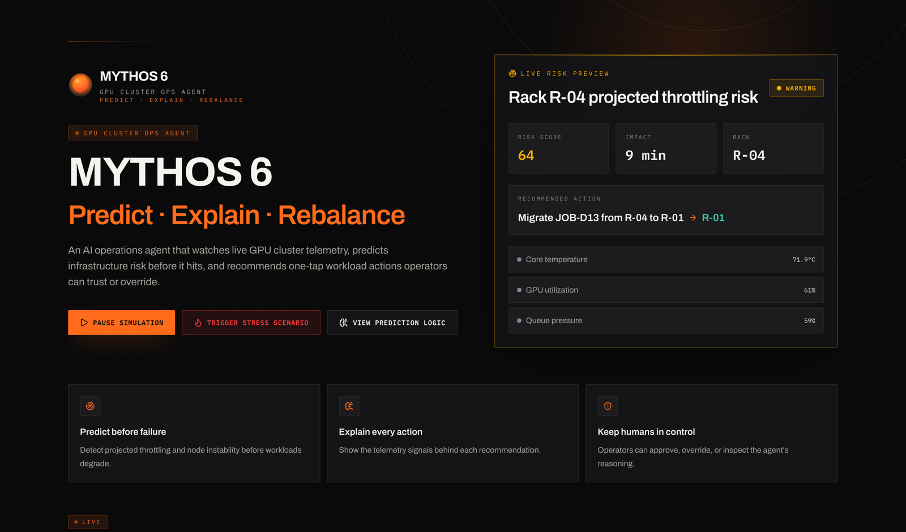

<div align="center">

# Mythos 6

**Predict · Explain · Rebalance**

A GPU cluster ops agent that watches live telemetry, predicts rack-level thermal
throttling before it happens, and gives operators one-tap workload migrations.

_Built for the RAISE AI Hackathon · Paris_



</div>

## What it does

- **Predict** — scores rack risk from live signals (temperature, trend, cooling,
  utilization, queue pressure, neighbor heat) and flags throttling before it hits.
- **Explain** — every recommendation surfaces the telemetry signals behind it.
- **Rebalance** — accept, override, or ask-why a one-tap workload migration; the
  agent learns from each operator decision.

## Stack

TanStack Start (React 19, SSR) · Vite · Tailwind v4 · shadcn/ui · Three.js ·
Recharts · TanStack Query

## Run locally

```bash
bun install
bun run dev        # http://localhost:8080
```

Runs against a built-in mock cluster by default. To point at a live backend, set
`VITE_USE_MOCKS=false` and `VITE_API_BASE_URL` — see
[INTEGRATION.md](INTEGRATION.md) for the API contract.

## Docs

- [INTEGRATION.md](INTEGRATION.md) — backend API contract
- [FRONTEND_REVAMP.md](FRONTEND_REVAMP.md) — design system & revamp notes
